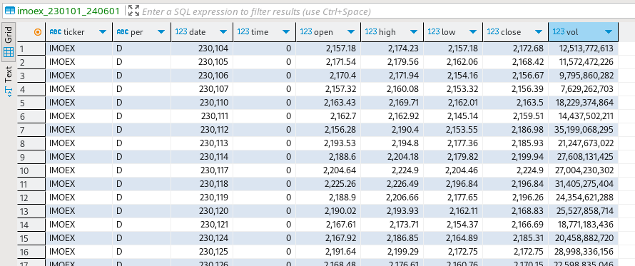
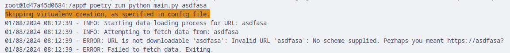
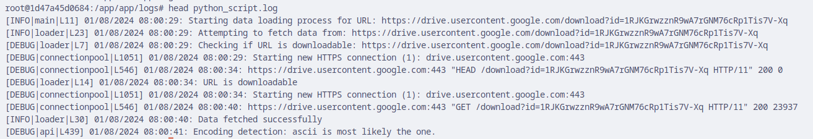

## Загрузчик данных для стажировки Simbirsoft

### 1. Введение

Данное приложение представляет собой загрузчик данных, разработанный на Python для тестового задания на стажировку Backend в Simbirsoft. Приложение загружает данные из CSV-файла, доступного по указанному пользователем URL-адресу, обрабатывает их с помощью библиотеки Pandas и загружает в базу данных PostgreSQL. Все решение контейнеризировано с помощью Docker для обеспечения переносимости и удобства развертывания.

### 2. Функциональное описание

Приложение выполняет следующие ключевые функции:

- **Получение данных:** Загружает CSV-данные по указанному URL-адресу.
- **Трансформация данных:**
  - Читает и обрабатывает данные CSV с помощью Pandas.
  - Очищает и форматирует имена столбцов для совместимости с базой данных.
  - Определяет подходящие типы данных для каждого столбца.
- **Загрузка данных:**
  - Динамически создает таблицу в базе данных на основе структуры CSV-файла.
  - Загружает данные в таблицу с помощью команды `COPY` для обеспечения эффективности.
- **Ведение журнала:** Записывает события приложения и ошибки в консоль и файл журнала.
- **Обработка ошибок:** В случае возникновения ошибок программа прекращает свою работу, а база данных откатывается до предыдущего состояния.

### 3. Архитектура приложения

Приложение имеет модульную структуру, где каждый компонент отвечает за определенные задачи:

- **`main.py`:** Управляет процессом загрузки данных.
- **`loader.py`:** Содержит функции для проверки URL-адреса и загрузки данных.
- **`database.py`:** Отвечает за подключение к базе данных, создание таблиц и загрузку данных.
- **`csv_functions.py`:** Предоставляет утилиты для обработки данных CSV, включая определение типа данных, форматирование строк и извлечение имени файла.
- **`logger.py`:** Настраивает систему журналирования.

### 4. Схема базы данных

Таблицы создаются динамически на основе структуры полученного CSV-файла. Имена таблиц и типы столбцов извлекаются из заголовков и данных CSV-файлов. Первичные ключи в текущей версии не используются.

### 5. Техническая реализация

#### 5.1 Инструменты разработки и библиотеки

- Язык: Python 3.11
- Библиотеки:
  - `requests`: Получение данных с URL-адреса.
  - `psycopg2-binary`: Взаимодействие с базой данных PostgreSQL.
  - `pandas`: Анализ и обработка данных.
  - `python-dotenv`: Загрузка переменных окружения из файла `.env`.
- Менеджер пакетов: Poetry
- Контейнеризация: Docker

### 6. Конфигурация Docker

- **`Dockerfile`:**
  - Создает образ приложения Python.
  - Устанавливает зависимости с помощью Poetry.
- **`docker-compose.yml`:**
  - Определяет два сервиса:
    - `postgres`: Запускает контейнер базы данных PostgreSQL.
    - `python`: Запускает контейнер приложения Python и связывает его с контейнером базы данных.

### 7. Развертывание и запуск

1. Клонируйте репозиторий:
   ```bash
   git clone https://github.com/Orlovchikk/simbirsoft-internship.git
   ```
2. Перейдите в директорию проекта:
   ```bash
   cd simbirsoft-internship
   ```
3. Создайте файл `.env` и заполните его по образцу `.env.example`, указав свои учетные данные для подключения к базе данных:
   ```
   host='postgres'
   POSTGRES_DB=название_вашей_базы_данных
   PGUSER=имя_пользователя_базы_данных
   POSTGRES_PASSWORD=пароль_базы_данных
   port=5432
   ```
4. Запустите Docker Compose:
   ```bash
   docker compose up -d
   ```
5. Подключитесь к контейнеру приложения:
   ```bash
   docker compose exec python bash
   ```
6. Запустите приложение, указав ссылку на CSV файл:
   ```bash
   poetry run python main.py 'ссылка_на_ваш_CSV_файл'
   ```

### 8. Скриншоты, демонстрирующие работу приложения

**Пример:**

1. **Вызов команды:**

   

2. **Созданная таблица `imoex_230101_240601`:** (Скриншот просмотра в приложении DBeaver с использованием данных из файла `.env`)



3. **Обработка ошибки "Invalid URL":**



4. **Скриншот с первыми строками из файла `python-script.log`:**


